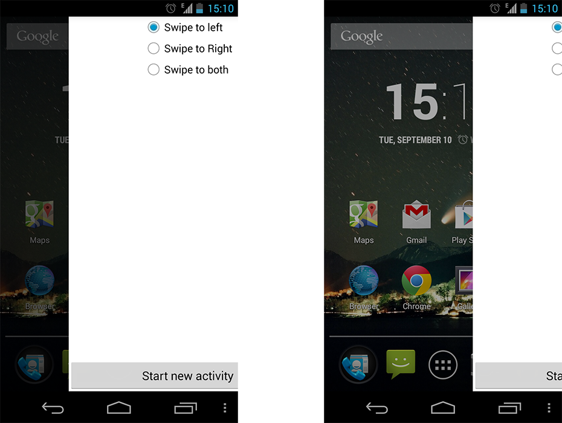

SwipeAwayLayout
===============
## Swipe it away!

There are many usage of this Layout.

You can use it as the root view of your activity(just change the implementation of the SwipeAwayLayout to your layout, eg.LinearLayout), 
then you can use the call back to finish the Activity when it is swiped away.

